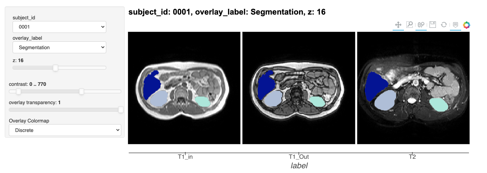

# PyViz Med
Interactive medical image viewer for jupyter notebooks.

## Installation
We recommend using Anaconda to manage dependencies and virtual environments.

### Dependencies:
1. Holoviews: `conda install -c pyviz holoviews bokeh datashader panel`
1. xArray: `conda install -c conda-forge xarray dask netCDF4 bottleneck`
1. SimpleITK: `conda install -c https://conda.anaconda.org/simpleitk SimpleITK`

### Pyviz_med
`git clone https://github.com/pollackscience/pyviz_med`  
`cd pyviz_med`  
`pip install -e .`  
`cd ..`

## Basic Tutorial
1. Download the CHAOS abdominal segmentation data (https://zenodo.org/record/3431873):  
    `cd pyviz_med/data/CHAOS`  
    `wget -O CHAOS.zip https://zenodo.org/record/3431873/files/CHAOS_Train_Sets.zip?download=1`  
    `unzip CHAOS.zip`
1. Open up the jupyter notebook `pyviz_med/notebook/CHAOS_Tutorial.ipynb`
1. Run all cells!

Brian Pollack 2020
University of Pittsburgh
